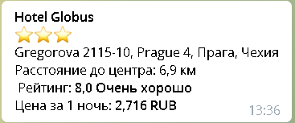

#TooEasyTravel_SearchHotels
TooEasyTravel_SearchHotels - это телеграм-бот для поиска отелей по всему миру.

Для поиска отелей используется открытый API Hotels, который расположен на сайте [rapidapi](https://www.rapidapi.com). 


###Возможности бота(команды)
* *hello_world* - бот посылает в ответ сообщение "Привет Мир!".
* *start* - бот приветствует пользователя, рассказывает для чего нужен.
* *help* - выдает пользователю список всех команд бота.
* *lowprice* - поиск самых дешевых отелей. Запрашивает у пользователя название города (ввод может осуществляться как на 
  русском, так и на английском языке, результат может отличаться, особенность используемого API). Запрашивает у 
  пользователя сколько показать (но не более 25).
* *highprice* - поиск самых дорогих отелей. Запрашивает у пользователя название города (ввод может осуществляться как на 
  русском, так и на английском языке, результат может отличаться, особенность используемого API). Запрашивает у 
  пользователя сколько показать (но не более 25).
* *bestdeal* - поиск самых дешёвых и находящихся ближе всего к центру. Запрашивает у пользователя название города (ввод 
  может осуществляться как на русском, так и на английском языке, результат может отличаться, особенность используемого 
  API). Запрашивает у пользователя сколько показать (но не более 25). Запрашивает минимальную и максимальную цену 
  за ночь и минимальное и максимальное расстояние от центра до отеля.
  
###Интерфейс вывода информации об отеле

* Название отеля
* Количество звезд
* Адрес отеля
* Расстояние от центра до отеля в км
* Рейтинг
* Цена за 1 ночь в рублях

###Установка
1. Клонируйте репозиторий 
2. Создайте виртуальное окружение
3. Установите зависимости `$ pipenv sync`
4. Создайте файл `.env` и создайте в нем переменные:
   ```
   TOKEN = "Токен вашего бота"
    KEY = "Ключ от API Hotels"
   ```
5. Запустите бота командой `python main.py`
   
